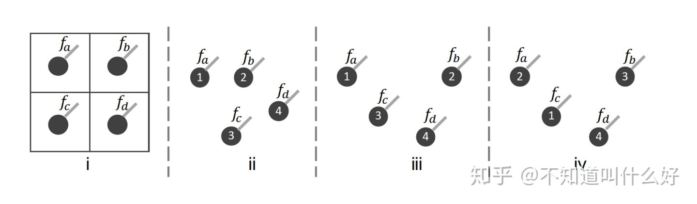
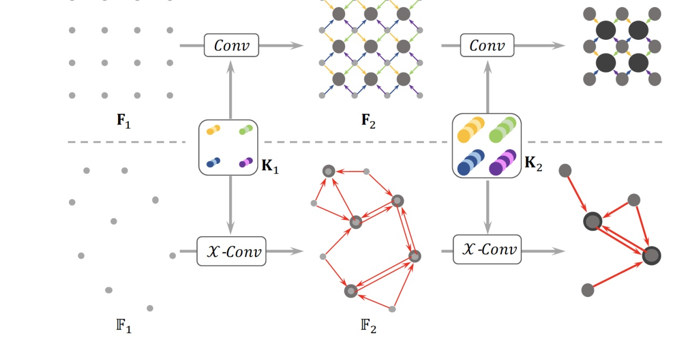
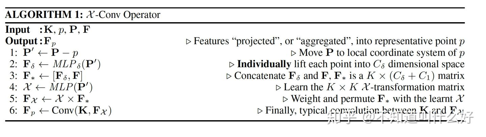
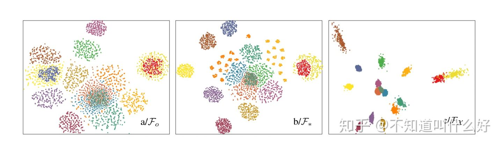

# PointCNN

NIPS 2018

From https://zhuanlan.zhihu.com/p/96067255

Paper: https://papers.nips.cc/paper/7362-pointcnn-convolution-on-x-transformed-points.pdf

Github: https://github.com/yangyanli/PointCNN

​		点云数据不同于传统的2D图片，点的位置没有规则，并且点之间没有顺序。这使得Convolution操作不太好直接处理点云。这篇文章通过一种自定义的 $\mathcal{X}$-Conv 操作，使常规的Convolution也能处理点云。本文对其进行大概的介绍。论文、代码地址如下：

## 1. 主要问题

假设有4个点组成的一个点云，对比常规的2D图片，示意图如下：

图(i)表示2D图片的情况，此时，四个点的位置顺序是固定的。对于点云，其位置顺序有很多可能，如图(ii, iii, iv)所示。如果对图(ii, iii, iv)执行Convolution操作：

对于Convolution来说，输入点的顺序发生变化，输出也会变化。这并不是我们希望的结果。因为它们是同一个点云，我们希望即使输入的顺序发生变化，Convolution也能得出相同的结果。所以，**点云里面的点的输入顺序，是阻碍Convolution操作的主要问题**。

为了处理以上问题，论文定义了一个 $\mathcal{X}$ 变换矩阵，**该矩阵能对某个特定顺序的输入进行处理，得到一个与顺序无关的feature**。先经过 $\mathcal{X}$ 变换矩阵处理，再执行Convolution的操作：

其中，**不同的输入顺序，对应不同的** $\mathcal{X}$ **变换矩阵**。对于以上等式中的 $f_{i i i}$和 $f_{i v}$ ，如果能够使 $\mathcal{X}_{i i i}=\mathcal{X}_{i v} \times \Pi$ ， $\Pi$ 满足：$\left[f_{a}, f_{b}, f_{c}, f_{d}\right]^{T}=\Pi \times\left[f_{c}, f_{a}, f_{b}, f_{d}\right]^{T}$，这样的话，$f_{i i i}$和 $f_{i v}$理论上就能相等，Convolution的输出不再与输入点的顺序有关。

以上就是 $\mathcal{X}$-Conv 操作的大致思路。

## 2. 算法

其中：

- $\mathbf{P}=\left(p_{1}, p_{2}, \ldots, p_{K}\right)^{T}$，表示邻居点；
- $\mathbf{F}=\left(f_{1}, f_{2}, \ldots, f_{K}\right)^{T}$ ，表示邻居点的feature；
- $\mathbf{K}$，表示convolution的kernel；
- $p$ ，表示目标点,（query point，or representative point)

为了计算出点$p$的feature，首先确定其邻居点集 $\mathbf{P}$（使用FPS，或者KNN），按以上算法操作：

1. 将所有邻居点的坐标转化为相对 $p$ 的坐标： $\mathbf{P}^{\prime} \leftarrow \mathbf{P}-p$ 
2. 用一个 $M L P_{\delta}$ 网络，将邻居点的位置信息转化为feature信息：$\mathbf{F}_{\delta} \leftarrow M L P_{\delta}\left(\mathbf{P}^{\prime}\right)$
3. 将转化得到的feature，与邻居点自己的feature拼接，得到新的feature：$\mathbf{F}_{*} \leftarrow\left[\mathbf{F}_{\delta}, \mathbf{F}\right]$
4. 用一个 $M L P$ 网络计算出特定输入顺序对应的 $\mathcal{X}$ 矩阵：$\mathcal{X} \leftarrow \operatorname{MLP}\left(\mathbf{P}^{\prime}\right)$
5. 用矩阵对特定顺序的feature矩阵进行处理： $\mathbf{F}_{\mathcal{X}} \leftarrow \mathcal{X} \times \mathbf{F}_{*}$
6. 执行Convolution： $\mathbf{F}_{p} \leftarrow \operatorname{Conv}(\mathbf{K}, \mathbf{F} \chi)$点的feature。

算法也可以用如下公式来表达：

$$
\mathbf{F}_{p}=\mathcal{X}-\operatorname{Conv}(\mathbf{K}, p, \mathbf{P}, \mathbf{F})=\operatorname{Conv}\left(\mathbf{K}, \mathrm{MLP}(\mathbf{P}-p) \times\left[M L P_{\delta}(\mathbf{P}-p), \mathbf{F}\right]\right)
$$
可以看出，对于不同的顺序，计算出来的 $\mathcal{X}$ 是不同的。

论文中给出了一个feature可视化的结果：

$\mathbf{F}_{*}$与邻居点的排列顺序有关，不同的排列顺序，得到的$\mathbf{F}_{*}$不同。第二张图中，同一个颜色的点，表示点 $p$ 的邻居点集，按不同的排列顺序得到的$\mathbf{F}_{*}$集合，用 T-SNE 可视化后的结果。对比第三张图片，可以看出，用 $\mathcal{X}$ 矩阵处理后的 $\mathbf{F}_{\mathcal{X}}$集合，同一个颜色的点更加集中一些。这说明$\mathcal{X}$ **矩阵虽然无法完全实现预期（同一个颜色的点的位置相同），但对不同顺序的feature，能起到一定的修正作用（同一个颜色的点变的集中一些）。**

## **3. 总结**

这篇论文的核心在于 $\mathcal{X}$ 矩阵。论文希望通过该矩阵来将邻居点的feature矩阵变得与邻居点的顺序无关。

